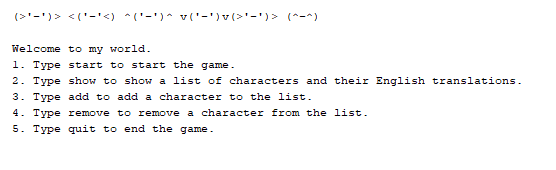
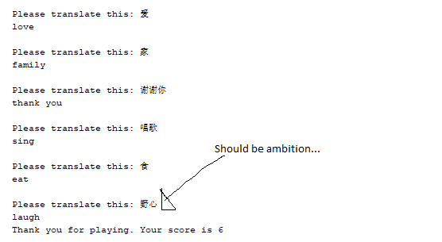

# ChineseVocabulary
Created a basic java program to help my friend learn Chinese. (He's currently learning Mandarin in Taiwan!)

Program description:

When the program is run, a random Chinese Character will auto-populate on to your screen. Your job is to type the English translation of the character. This process will continue until you type an incorrect translation. When the game ends, the program will tell you your total score.

Additional details / features:

- You may add additional Chinese Characters or remove Chinese characters from the list.
- The Chinese characters and their associated English translations were saved into a HashMap

Starting Screen:

Game in progress:

